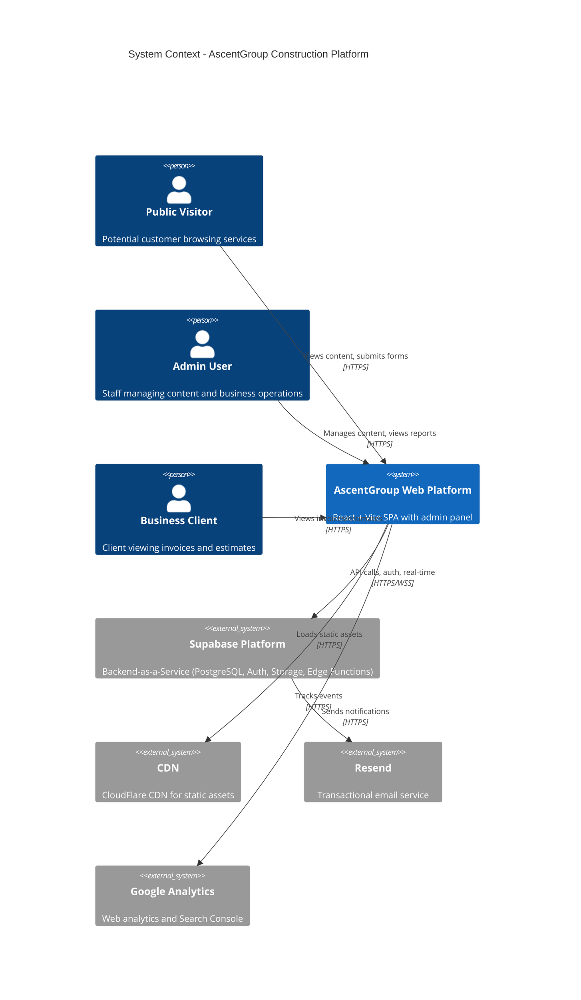
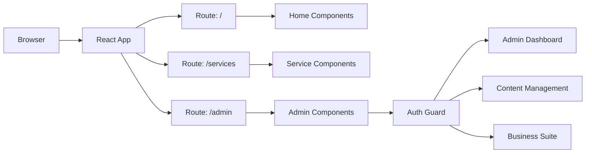
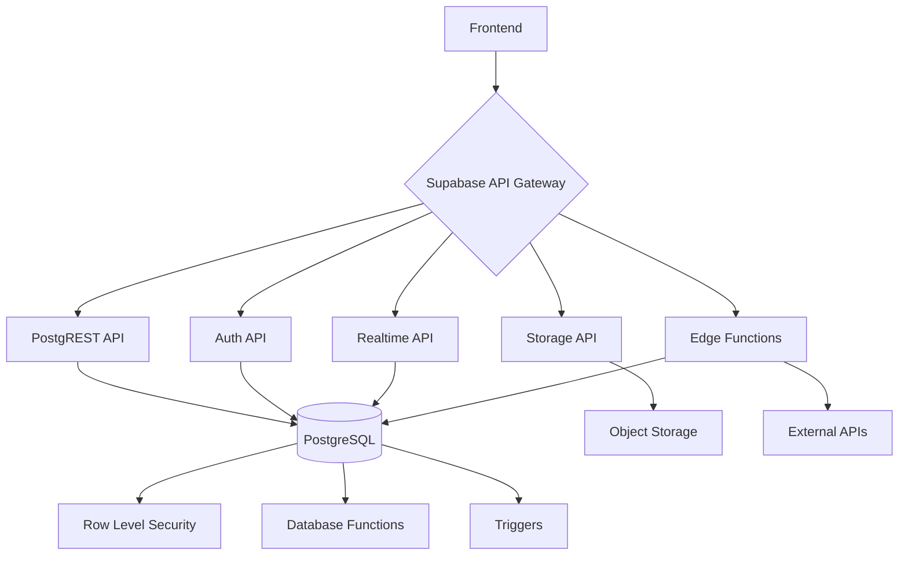
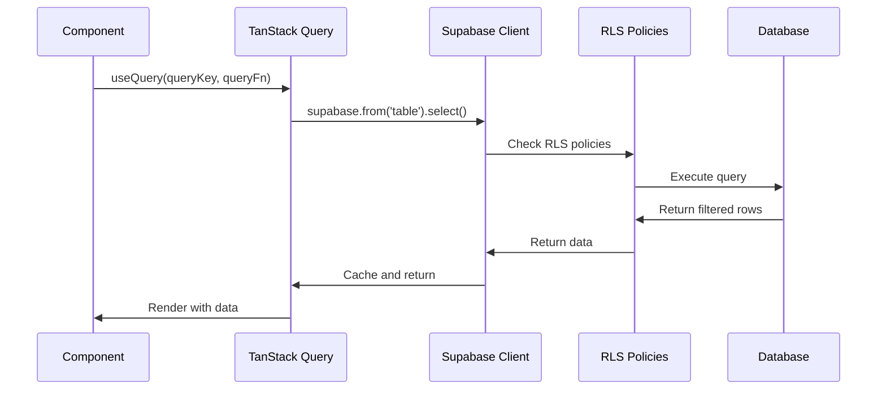
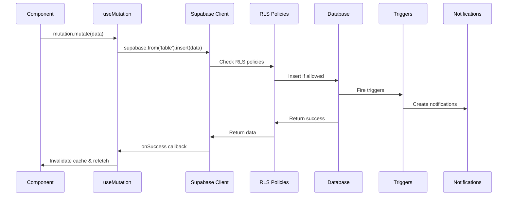
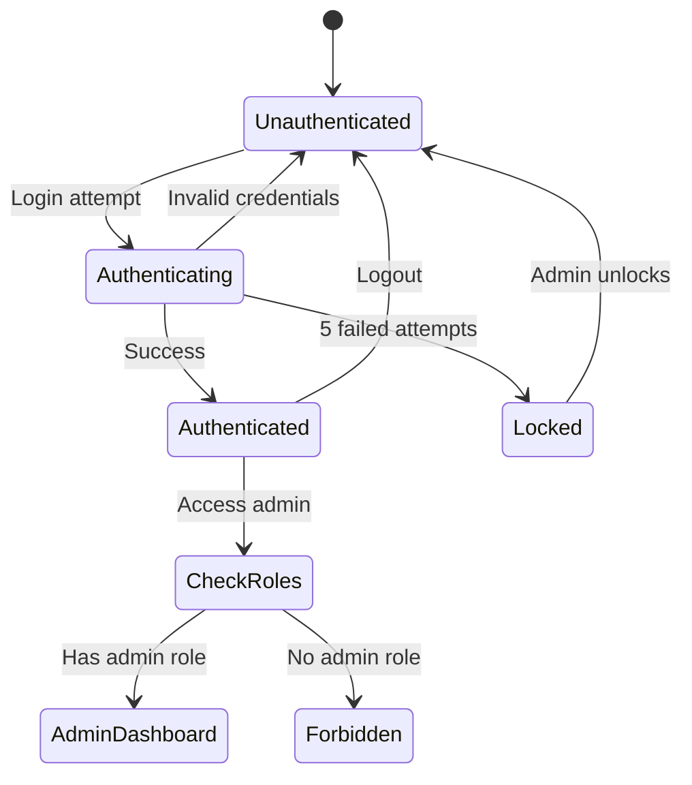
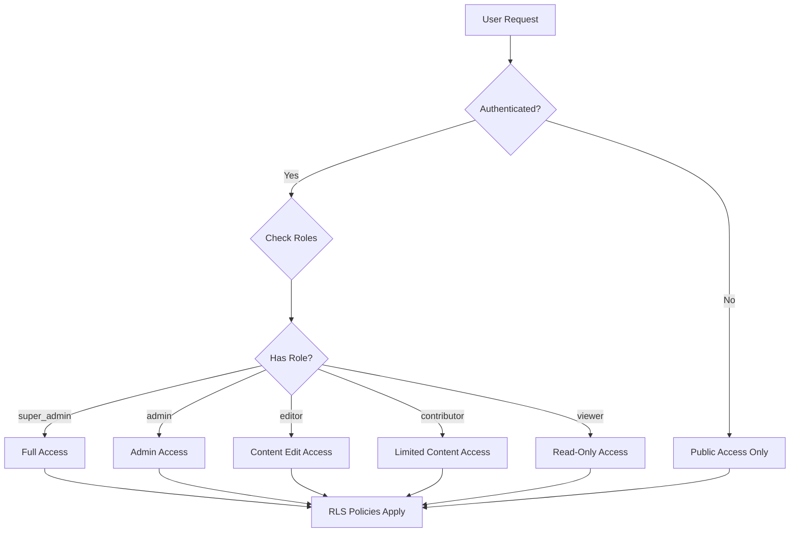
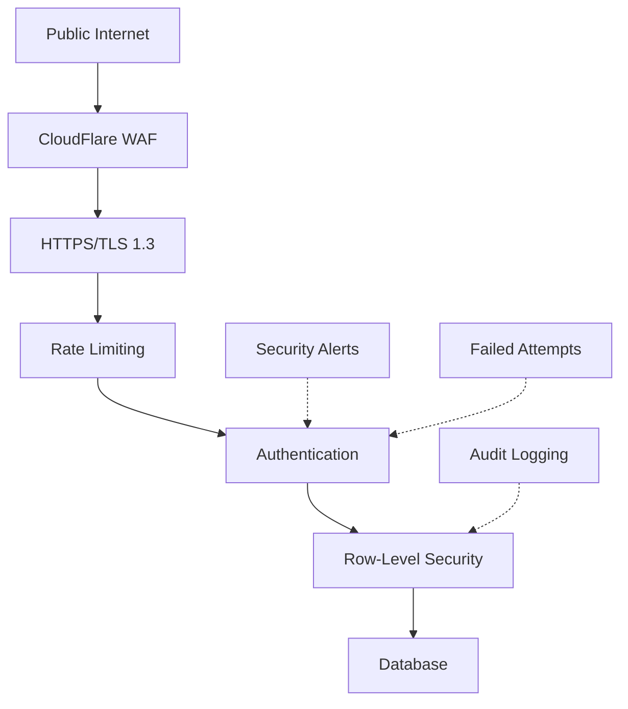

# Architecture Overview

> High-level technical architecture for the AscentGroup Construction platform

---

## System Architecture Diagram



---

## Technology Stack

### Frontend Stack

| Layer          | Technology        | Purpose                                    |
| -------------- | ----------------- | ------------------------------------------ |
| Framework      | React 18.3        | UI library                                 |
| Build Tool     | Vite 6.0          | Fast HMR, modern bundling                  |
| Routing        | React Router 6.30 | Client-side routing                        |
| Styling        | Tailwind CSS 3.4  | Utility-first CSS                          |
| UI Components  | shadcn/ui         | Accessible component primitives            |
| State          | TanStack Query    | Server state management                    |
| Forms          | React Hook Form   | Form validation and handling               |
| Validation     | Zod               | Schema validation                          |
| Rich Text      | Quill             | WYSIWYG editor for admin                   |
| File Upload    | React Dropzone    | Drag-and-drop file uploads                 |
| PDF Generation | React PDF         | Generate invoices/estimates as PDF         |
| Analytics      | Web Vitals        | Core Web Vitals tracking                   |
| Icons          | Lucide React      | Icon library                               |
| Animations     | Framer Motion     | Smooth animations                          |
| Date Handling  | date-fns          | Date formatting and manipulation           |
| Charts         | Recharts          | Data visualization                         |
| Lightbox       | yet-another...    | Image lightbox for galleries               |

### Backend Stack (Supabase)

| Service              | Purpose                        |
| -------------------- | ------------------------------ |
| PostgreSQL 15        | Relational database            |
| PostgREST            | Auto-generated REST API        |
| GoTrue               | Authentication service         |
| Realtime             | WebSocket subscriptions        |
| Storage              | Object storage for files       |
| Edge Functions (Deno | Serverless functions           |
| pg_cron              | Scheduled jobs                 |

### DevOps & Tooling

| Tool              | Purpose                         |
| ----------------- | ------------------------------- |
| GitHub Actions    | CI/CD pipeline                  |
| Lighthouse CI     | Performance auditing            |
| ESLint            | Code linting                    |
| Prettier          | Code formatting                 |
| TypeScript 5.6    | Type safety                     |
| Playwright        | E2E testing                     |
| Vercel/Netlify    | Frontend hosting                |

---

## Architecture Patterns

### 1. Frontend Architecture

**Pattern:** Single Page Application (SPA) with code splitting



**Key Decisions:**

- **Client-side routing:** Fast navigation without full page reloads
- **Code splitting:** Lazy load admin routes to reduce initial bundle size
- **Component composition:** Reusable components via props and composition
- **Design system:** Centralized design tokens in `index.css` and `tailwind.config.ts`

### 2. Backend Architecture

**Pattern:** Backend-as-a-Service (BaaS) with Edge Functions



**Key Decisions:**

- **Row-Level Security (RLS):** Security enforced at database layer, not application layer
- **Database functions:** Business logic in PostgreSQL (auto-increment numbers, authorization checks)
- **Edge Functions:** Serverless functions for custom logic (email sending, external API calls)
- **Real-time subscriptions:** Live updates for admin dashboard

### 3. Data Flow Architecture

**Read Flow:**



**Write Flow:**



### 4. Authentication & Authorization

**Authentication Flow:**



**Authorization Levels:**



**Role Hierarchy:**

1. **super_admin** - Full system access, can manage users and roles
2. **admin** - Can manage content, view business data, configure settings
3. **editor** - Can create and edit content (projects, blog posts, services)
4. **contributor** - Can create drafts, requires approval to publish
5. **viewer** - Read-only access to admin panel
6. **public** - Unauthenticated users (view published content only)

---

## Security Architecture

### Defense in Depth Layers



**Layer 1: Network Security**
- CloudFlare DDoS protection
- TLS 1.3 encryption
- HSTS headers
- CSP headers

**Layer 2: Application Security**
- Rate limiting (50 req/min per IP on forms)
- CSRF protection via SameSite cookies
- XSS prevention via DOMPurify
- Input validation via Zod schemas

**Layer 3: Authentication Security**
- Bcrypt password hashing
- Failed login tracking (`auth_failed_attempts`)
- Account lockout after 5 failures
- Session token rotation
- httpOnly cookies

**Layer 4: Authorization Security**
- Role-based access control (RBAC)
- Row-Level Security (RLS) policies
- `SECURITY DEFINER` functions for privilege checks
- Separate `user_roles` table (prevents privilege escalation)

**Layer 5: Data Security**
- Encrypted at rest (AES-256)
- Encrypted in transit (TLS 1.3)
- Sensitive data audit logging (`audit_log` table)
- PII access tracking
- Regular backups with encryption

**Layer 6: Monitoring & Response**
- Security alerts for suspicious activity
- Real-time monitoring via `security_alerts` table
- Comprehensive audit trail
- Automated cleanup jobs for old data

---

## Performance Optimization Strategies

### 1. Frontend Optimizations

**Code Splitting:**
```typescript
// Lazy load admin routes
const AdminDashboard = lazy(() => import('@/pages/admin/Dashboard'));
const BlogPostEditor = lazy(() => import('@/pages/admin/BlogPostEditor'));
```

**Image Optimization:**
- Lazy loading with Intersection Observer
- Responsive images with `srcset`
- WebP format with JPEG fallback
- Image CDN for automatic optimization

**Bundle Optimization:**
- Tree shaking unused code
- Minification and compression (Brotli)
- Long-term caching with content hashing
- Preloading critical assets

**React Optimizations:**
- `React.memo()` for expensive components
- `useMemo()` for expensive calculations
- `useCallback()` for stable function references
- Virtual scrolling for long lists (TanStack Virtual)

### 2. Backend Optimizations

**Database Indexing:**
```sql
-- Indexes on frequently queried columns
CREATE INDEX idx_projects_slug ON projects(slug);
CREATE INDEX idx_blog_posts_published_at ON blog_posts(published_at DESC);
CREATE INDEX idx_user_roles_user_id ON user_roles(user_id);

-- GIN index for JSONB columns
CREATE INDEX idx_projects_tags ON projects USING GIN(tags);
```

**Query Optimization:**
- Select only needed columns (avoid `SELECT *`)
- Use database views for complex queries
- Implement pagination for large result sets
- Cache frequently accessed data

**Connection Pooling:**
- Supabase handles connection pooling automatically
- Edge Functions use connection pooler

**Caching Strategy:**
- TanStack Query caches API responses
- Stale-while-revalidate pattern
- CDN caching for static assets (1 year)
- Browser caching via Cache-Control headers

### 3. Monitoring & Metrics

**Core Web Vitals:**
- **LCP (Largest Contentful Paint):** Target < 2.5s
- **FID (First Input Delay):** Target < 100ms
- **CLS (Cumulative Layout Shift):** Target < 0.1

**Custom Metrics:**
- Time to First Byte (TTFB)
- Time to Interactive (TTI)
- Total Blocking Time (TBT)

**Tracking:**
```typescript
// src/lib/webVitals.ts
import { getCLS, getFID, getLCP } from 'web-vitals';

function sendToAnalytics(metric) {
  // Send to performance_metrics table
  supabase.from('performance_metrics').insert({
    metric_type: 'web_vitals',
    metric_name: metric.name,
    value: metric.value,
    metadata: { url: window.location.pathname }
  });
}

getCLS(sendToAnalytics);
getFID(sendToAnalytics);
getLCP(sendToAnalytics);
```

---

## Scalability Considerations

### Current Scale

- **Database:** < 10k rows per table (plenty of headroom)
- **Storage:** < 5GB (mostly images)
- **Traffic:** ~1k visitors/day (~30k/month)
- **Edge Functions:** < 100 invocations/day

### Scaling Strategies

**Horizontal Scaling:**
- Frontend: Deploy to multiple CDN edges (CloudFlare)
- Backend: Supabase auto-scales connection pooling
- Database: Read replicas if needed (Supabase Pro plan)

**Vertical Scaling:**
- Upgrade Supabase plan for more resources
- Increase database compute for complex queries

**Caching:**
- Implement Redis for session storage (future)
- CDN caching for API responses (Varnish/Fastly)
- Service Worker for offline support

**Database Partitioning:**
- Partition `audit_log` by month (when > 1M rows)
- Partition `performance_metrics` by month
- Archive old `analytics_snapshots` to cold storage

---

## Disaster Recovery & Business Continuity

### Backup Strategy

**Automated Backups:**
- Daily full database backups (retained 30 days)
- Point-in-time recovery (7 days)
- Storage bucket replication

**Manual Backups:**
```bash
# Export database
pg_dump -h db.xdowuirheazerlwatwja.supabase.co -U postgres > backup.sql

# Export storage bucket
aws s3 sync s3://project-images ./backup-images
```

### Recovery Procedures

**Database Corruption:**
1. Stop all writes
2. Restore from latest backup
3. Replay WAL logs to latest transaction
4. Verify data integrity
5. Resume operations

**Edge Function Failure:**
1. Check logs for error details
2. Rollback to previous version
3. Fix bug and redeploy
4. Monitor for issues

**CDN Outage:**
1. Verify CloudFlare status
2. Update DNS to backup CDN (Fastly)
3. Invalidate old cache
4. Monitor traffic

### Incident Response

**Severity Levels:**

| Level    | Response Time | Example                    |
| -------- | ------------- | -------------------------- |
| Critical | 15 minutes    | Database down, auth broken |
| High     | 1 hour        | Admin panel inaccessible   |
| Medium   | 4 hours       | Performance degradation    |
| Low      | 24 hours      | Minor UI bug               |

**Response Team:**
- On-call engineer (rotates weekly)
- Team lead (escalation)
- CTO (critical incidents only)

**Communication:**
- Slack #incidents channel
- Status page (status.ascentgroup.com)
- Customer email (if customer-facing)

---

## Architectural Decision Records (ADRs)

### ADR-001: Why Supabase over Custom Backend

**Context:** Need backend for authentication, database, file storage, and real-time updates.

**Decision:** Use Supabase (managed PostgreSQL + Auth + Storage + Realtime).

**Rationale:**
- Faster time to market (no infrastructure setup)
- Built-in Row-Level Security (better than app-level auth)
- Real-time subscriptions out of the box
- Automatic API generation via PostgREST
- Cost-effective at current scale

**Consequences:**
- Vendor lock-in (mitigated by PostgreSQL standard)
- Limited control over database configuration
- Requires learning Supabase patterns

**Alternatives Considered:**
- Custom Node.js + Express + PostgreSQL (too much overhead)
- Firebase (poor relational data modeling)
- AWS Amplify (complex setup)

### ADR-002: Why shadcn/ui over Material-UI

**Context:** Need accessible, customizable UI component library.

**Decision:** Use shadcn/ui (Radix UI primitives + Tailwind).

**Rationale:**
- Components copied to project (full control)
- Accessible by default (Radix UI)
- Works seamlessly with Tailwind
- No runtime dependency bloat
- Easy to customize

**Consequences:**
- Need to maintain component code ourselves
- Less "batteries included" than MUI

**Alternatives Considered:**
- Material-UI (too opinionated, large bundle)
- Ant Design (not flexible enough)
- Chakra UI (heavier than needed)

### ADR-003: Why TanStack Query over Redux

**Context:** Need state management for server data.

**Decision:** Use TanStack Query (React Query) for server state, avoid Redux.

**Rationale:**
- Server state handled automatically (caching, refetching, background updates)
- Reduces boilerplate significantly
- Built-in loading/error states
- Optimistic updates support
- Devtools for debugging

**Consequences:**
- Another library to learn
- Client state still needs separate solution (useState/Context)

**Alternatives Considered:**
- Redux Toolkit + RTK Query (too much boilerplate)
- SWR (less features than TanStack Query)
- Apollo Client (GraphQL-specific, overkill)

---

## Future Architecture Improvements

### Short-Term (Next 3 Months)

1. **Implement comprehensive testing**
   - Unit tests with Jest
   - Integration tests for API
   - E2E tests with Playwright

2. **Add error tracking**
   - Integrate Sentry for error monitoring
   - Set up error rate alerts
   - Create error dashboard

3. **Enhance monitoring**
   - Set up uptime monitoring (UptimeRobot)
   - Create business metrics dashboard
   - Add custom alerts for critical flows

### Medium-Term (6-12 Months)

1. **Progressive Web App (PWA)**
   - Add service worker
   - Offline support for viewing cached projects
   - Push notifications for admin

2. **GraphQL API**
   - Add Hasura or PostGraphile layer
   - Reduce over-fetching with precise queries
   - Real-time subscriptions via GraphQL

3. **Microservices for heavy processing**
   - Image processing service (thumbnail generation)
   - PDF generation service (invoices/estimates)
   - Email templating service

### Long-Term (1-2 Years)

1. **Multi-tenancy**
   - Support multiple construction companies
   - White-label solution
   - Tenant isolation at database level

2. **Mobile apps**
   - React Native app for field workers
   - Project photo uploads from mobile
   - Time tracking and materials logging

3. **AI features**
   - AI-powered estimate generation
   - Chatbot for customer inquiries
   - Automated content generation for SEO

---

## Related Documentation

- [Database ERD](./DATABASE_ERD.md) - Complete database schema
- [Data Flow Diagrams](./DATA_FLOW_DIAGRAMS.md) - Feature workflows
- [Developer Onboarding](./DEVELOPER_ONBOARDING.md) - Setup guide
- [Security Documentation](./SECURITY_PHASE1.md) - Security details
- [Performance Optimization](./PERFORMANCE_OPTIMIZATION_2025.md) - Performance guide

---

**Version:** 1.0  
**Last Updated:** January 4, 2025  
**Author:** Platform Architecture Team
