# Database Schema - Entity Relationship Diagram

> Complete database schema for AscentGroup Construction platform with 52+ tables

---

## Overview

The database is organized into logical domains:
- **User Management** - Authentication, roles, profiles
- **Content Management** - Services, projects, blog posts
- **Business Operations** - Clients, estimates, invoices, payments
- **Lead Management** - Contact forms, resume submissions, prequalifications
- **Settings & Configuration** - Site settings, page-specific settings
- **Security & Audit** - Auth tracking, security alerts, audit logs
- **Analytics & Monitoring** - Performance metrics, error logs

---

## Complete Entity Relationship Diagram

```mermaid
erDiagram
    %% User Management Domain
    profiles ||--o{ user_roles : "has"
    profiles ||--o{ user_sessions : "has"
    profiles {
        uuid id PK
        uuid user_id FK
        string email
        string full_name
        timestamp created_at
        timestamp updated_at
    }
    
    user_roles {
        uuid id PK
        uuid user_id FK
        enum role
        timestamp created_at
    }
    
    user_sessions {
        uuid id PK
        uuid user_id FK
        string session_token
        timestamp expires_at
        string ip_address
        string user_agent
    }

    %% Content Domain
    services ||--o{ project_services : "tagged in"
    projects ||--o{ project_services : "uses"
    projects ||--o{ media : "has"
    blog_posts ||--o{ media : "has"
    
    services {
        uuid id PK
        string slug UK
        string name
        text description
        jsonb process_steps
        jsonb faq_items
        enum publish_state
        string preview_token
        timestamp created_at
    }
    
    projects {
        uuid id PK
        string slug UK
        string title
        text description
        jsonb gallery
        jsonb tags
        enum publish_state
        string preview_token
        timestamp created_at
    }
    
    blog_posts {
        uuid id PK
        string slug UK
        string title
        text content
        string category
        array tags
        uuid author_id FK
        enum publish_state
        string preview_token
        timestamp published_at
    }
    
    project_services {
        uuid id PK
        uuid project_id FK
        uuid service_id FK
    }
    
    media {
        uuid id PK
        string url
        string filename
        string mime_type
        integer width
        integer height
        uuid uploaded_by FK
        timestamp created_at
    }

    %% Business Operations Domain
    business_clients ||--o{ business_projects : "has"
    business_projects ||--o{ business_estimates : "has"
    business_projects ||--o{ business_invoices : "has"
    business_estimates ||--o{ business_estimate_line_items : "contains"
    business_invoices ||--o{ business_invoice_line_items : "contains"
    business_invoices ||--o{ business_payments : "receives"
    
    business_clients {
        uuid id PK
        string company_name
        string contact_name
        string email
        string phone
        text billing_address
        enum client_type
        timestamp created_at
    }
    
    business_projects {
        uuid id PK
        string project_number UK
        uuid client_id FK
        string project_name
        enum status
        enum priority
        date inquiry_date
        date scheduled_start_date
        bigint estimated_value_cents
        timestamp created_at
    }
    
    business_estimates {
        uuid id PK
        string estimate_number UK
        uuid project_id FK
        enum status
        date estimate_date
        date valid_until
        bigint subtotal_cents
        bigint tax_cents
        bigint total_cents
        timestamp created_at
    }
    
    business_estimate_line_items {
        uuid id PK
        uuid estimate_id FK
        integer line_number
        text description
        numeric quantity
        bigint unit_price_cents
        bigint line_total_cents
    }
    
    business_invoices {
        uuid id PK
        string invoice_number UK
        uuid project_id FK
        enum status
        date invoice_date
        date due_date
        bigint subtotal_cents
        bigint amount_paid_cents
        bigint balance_cents
        timestamp created_at
    }
    
    business_invoice_line_items {
        uuid id PK
        uuid invoice_id FK
        integer line_number
        text description
        numeric quantity
        bigint unit_price_cents
        bigint line_total_cents
    }
    
    business_payments {
        uuid id PK
        uuid invoice_id FK
        date payment_date
        bigint amount_cents
        enum payment_method
        string reference_number
        timestamp created_at
    }
    
    business_unit_costs {
        uuid id PK
        string category
        string name
        text description
        string unit
        bigint cost_cents
        boolean is_active
    }
    
    business_activity_log {
        uuid id PK
        uuid user_id FK
        string action
        string entity_type
        uuid entity_id
        jsonb details
        timestamp created_at
    }

    %% Lead Management Domain
    contact_submissions {
        uuid id PK
        string name
        string email
        string phone
        text message
        string submission_type
        enum status
        text admin_notes
        timestamp created_at
    }
    
    resume_submissions {
        uuid id PK
        string applicant_name
        string email
        string phone
        string position
        text cover_letter
        string resume_url
        enum status
        timestamp created_at
    }
    
    prequalification_downloads {
        uuid id PK
        string company_name
        string contact_name
        string email
        string project_type
        enum status
        timestamp downloaded_at
    }

    %% Settings Domain
    site_settings {
        uuid id PK
        string company_name
        string tagline
        string main_phone
        string email
        jsonb business_hours
        jsonb social_links
        jsonb certifications
        text robots_txt
        boolean is_active
    }
    
    about_page_settings {
        uuid id PK
        integer years_in_business
        integer total_projects
        jsonb story_content
        jsonb values
        jsonb licenses
        jsonb memberships
        jsonb insurance
        boolean is_active
    }
    
    footer_settings {
        uuid id PK
        jsonb quick_links
        jsonb contact_info
        jsonb social_media
        jsonb trust_bar_items
        boolean is_active
    }
    
    contact_page_settings {
        uuid id PK
        string office_address
        string main_phone
        string general_email
        string weekday_hours
        string map_embed_url
        boolean is_active
    }
    
    landing_page {
        uuid id PK
        string headline
        string subheadline
        jsonb featured_stories
        string background_image
        string cta_primary_text
        boolean is_active
    }

    %% Supporting Tables
    testimonials {
        uuid id PK
        text quote
        string author_name
        string company_name
        numeric rating
        enum publish_state
        boolean is_featured
    }
    
    stats {
        uuid id PK
        string label
        integer value
        string suffix
        string icon_name
        boolean is_active
    }
    
    certifications {
        uuid id PK
        string name
        string logo_url
        text description
        date expiry_date
        boolean is_active
    }
    
    templates {
        uuid id PK
        string name
        string type
        jsonb content
        boolean is_active
        boolean is_default
    }
    
    navigation_menus {
        uuid id PK
        string name
        string location
        jsonb items
        boolean is_active
    }

    %% Security & Audit Domain
    auth_failed_attempts {
        uuid id PK
        string user_identifier
        string ip_address
        string user_agent
        timestamp attempt_time
    }
    
    auth_account_lockouts {
        uuid id PK
        string user_identifier
        timestamp locked_at
        timestamp locked_until
        timestamp unlocked_at
        uuid unlocked_by FK
    }
    
    security_alerts {
        uuid id PK
        uuid user_id FK
        string alert_type
        string severity
        text description
        jsonb metadata
        boolean resolved
        timestamp created_at
    }
    
    audit_log {
        uuid id PK
        string object_type
        uuid object_id
        string action
        uuid user_id FK
        jsonb before_state
        jsonb after_state
        string ip_address
        timestamp created_at
    }
    
    notifications {
        uuid id PK
        uuid user_id FK
        string type
        string title
        text message
        string link
        jsonb metadata
        boolean is_read
        timestamp created_at
    }

    %% Analytics & Monitoring Domain
    performance_metrics {
        uuid id PK
        string metric_type
        string metric_name
        numeric value
        string unit
        jsonb metadata
        timestamp recorded_at
    }
    
    error_logs {
        uuid id PK
        text message
        text stack
        string url
        string user_agent
        jsonb context
        timestamp created_at
    }
    
    analytics_snapshots {
        uuid id PK
        date snapshot_date
        string page_path
        integer page_views
        integer unique_visitors
        numeric avg_time_on_page
        numeric bounce_rate
    }
    
    sitemap_logs {
        uuid id PK
        timestamp generated_at
        integer url_count
        string status
        text error_message
    }

    %% Workflow & Versioning
    approval_workflows {
        uuid id PK
        string entity_type
        uuid entity_id
        enum status
        uuid submitted_by FK
        uuid reviewer_id FK
        timestamp submitted_at
        timestamp reviewed_at
    }
    
    content_versions {
        uuid id PK
        string entity_type
        uuid entity_id
        integer version_number
        jsonb content_snapshot
        uuid changed_by FK
        text change_summary
        timestamp created_at
    }

    %% Task Management
    tasks {
        uuid id PK
        uuid project_id FK
        string title
        text description
        enum status
        enum priority
        uuid assigned_to FK
        date due_date
        timestamp created_at
    }
    
    task_comments {
        uuid id PK
        uuid task_id FK
        uuid user_id FK
        text comment
        timestamp created_at
    }

    %% Additional Support Tables
    rate_limits {
        uuid id PK
        string user_identifier
        string endpoint
        integer request_count
        timestamp window_start
    }
    
    seo_settings {
        uuid id PK
        string entity_type
        uuid entity_id
        string meta_title
        text meta_description
        string canonical_url
        integer seo_score
    }
    
    google_auth_tokens {
        uuid id PK
        uuid user_id FK
        string access_token
        string refresh_token
        timestamp token_expiry
        string scope
    }
    
    newsletter_subscribers {
        uuid id PK
        string email UK
        string source
        timestamp subscribed_at
        timestamp unsubscribed_at
    }
```



---

## Domain Descriptions

### 1. User Management Domain
**Purpose:** Handle authentication, authorization, and user profiles

**Key Tables:**
- `profiles` - Extended user information beyond auth.users
- `user_roles` - Role-based access control (admin, editor, contributor)
- `user_sessions` - Active session tracking

**Security:** RLS policies ensure users can only access their own data; admins have elevated privileges via `is_admin()` function.

---

### 2. Content Management Domain
**Purpose:** Manage public-facing content (services, portfolio, blog)

**Key Tables:**
- `services` - Service offerings with rich content
- `projects` - Portfolio projects with galleries
- `blog_posts` - Articles and case studies
- `project_services` - Many-to-many relationship
- `media` - Centralized media library

**Features:**
- Preview tokens for draft content review
- Publish state workflow (draft, scheduled, published)
- SEO fields on all content tables
- Version tracking via `content_versions`

---

### 3. Business Operations Domain
**Purpose:** Internal business management (CRM, estimates, invoicing)

**Key Tables:**
- `business_clients` - Client database
- `business_projects` - Internal project tracking
- `business_estimates` - Quote generation
- `business_invoices` - Billing and payments
- `business_payments` - Payment records

**Business Logic:**
- Auto-generated numbers (EST-2025-001, INV-2025-001)
- Line item structure for estimates/invoices
- Payment tracking with balance calculation
- Activity logging for audit trail

---

### 4. Lead Management Domain
**Purpose:** Capture and manage incoming leads

**Key Tables:**
- `contact_submissions` - General inquiries
- `resume_submissions` - Job applications
- `prequalification_downloads` - RFP requests

**Features:**
- Admin notification triggers
- Status workflow (new, contacted, closed)
- Admin notes for follow-up

---

### 5. Settings Domain
**Purpose:** Centralized configuration management

**Key Tables:**
- `site_settings` - Global company info
- `about_page_settings` - About page content
- `footer_settings` - Footer configuration
- `contact_page_settings` - Contact page details

**Pattern:** Each table has `is_active` flag; only one active record per table.

---

### 6. Security & Audit Domain
**Purpose:** Security monitoring and compliance

**Key Tables:**
- `auth_failed_attempts` - Login failure tracking
- `auth_account_lockouts` - Account lockout records
- `security_alerts` - Security event notifications
- `audit_log` - All data changes with before/after states

**Security Features:**
- Rate limiting via `rate_limits` table
- Failed login tracking with auto-lockout
- Comprehensive audit trail
- IP address and user agent logging

---

### 7. Analytics & Monitoring Domain
**Purpose:** Performance tracking and error monitoring

**Key Tables:**
- `performance_metrics` - Web Vitals and custom metrics
- `error_logs` - Client-side error tracking
- `analytics_snapshots` - Daily analytics aggregation

---

## Key Relationships

### Content Publishing Flow
```
services/projects/blog_posts
  → content_versions (versioning)
  → approval_workflows (review)
  → media (attachments)
  → seo_settings (SEO metadata)
```

### Business Management Flow
```
business_clients
  → business_projects
    → business_estimates
      → business_estimate_line_items
    → business_invoices
      → business_invoice_line_items
      → business_payments
```

### User Permission Flow
```
profiles (from auth.users)
  → user_roles (RBAC)
  → audit_log (action tracking)
  → notifications (alerts)
```

---

## Indexes & Performance

**Critical Indexes:**
- `slug` columns on all content tables (unique index)
- `published_at` for chronological queries
- `user_id` foreign keys
- GIN indexes on JSONB columns for tag searches
- Composite indexes on `(entity_type, entity_id)` for polymorphic tables

**Query Optimization:**
- Use `select('*')` sparingly; specify needed columns
- Leverage RLS for security rather than application logic
- Use database functions for complex authorization checks

---

## Migration Strategy

When adding new tables:
1. Create migration file in `supabase/migrations/`
2. Define table with appropriate constraints
3. Enable RLS: `ALTER TABLE table_name ENABLE ROW LEVEL SECURITY;`
4. Create RLS policies using `is_admin()` or `can_edit_content()` functions
5. Add indexes for foreign keys and frequently queried columns
6. Update TypeScript types (auto-generated)

---

## Backup & Recovery

- **Automated backups:** Daily snapshots retained for 30 days
- **Point-in-time recovery:** Available for last 7 days
- **Manual backup:** Use `pg_dump` for local development copies
- **Restore procedure:** Documented in incident response playbook

---

## Database Functions

**Authorization Functions:**
- `is_admin(user_id)` - Check if user has admin/super_admin role
- `can_edit_content(user_id)` - Check if user can modify content
- `has_role(user_id, role)` - Generic role check

**Business Logic Functions:**
- `generate_project_number()` - Auto-increment project numbers
- `generate_estimate_number()` - Auto-increment estimate numbers
- `generate_invoice_number()` - Auto-increment invoice numbers
- `check_and_update_rate_limit()` - Rate limiting enforcement

**Utility Functions:**
- `update_updated_at_column()` - Trigger to auto-update timestamps
- `normalize_slug()` - Ensure slug consistency
- `cleanup_*()` - Scheduled cleanup functions

---

## References

- [RLS Audit Results](./RLS_AUDIT_RESULTS.md)
- [Security Documentation](./SECURITY_PHASE1.md)
- [Company Settings System](./COMPANY_SETTINGS.md)
- [Projects CMS Guide](../PROJECTS_CMS_GUIDE.md)
