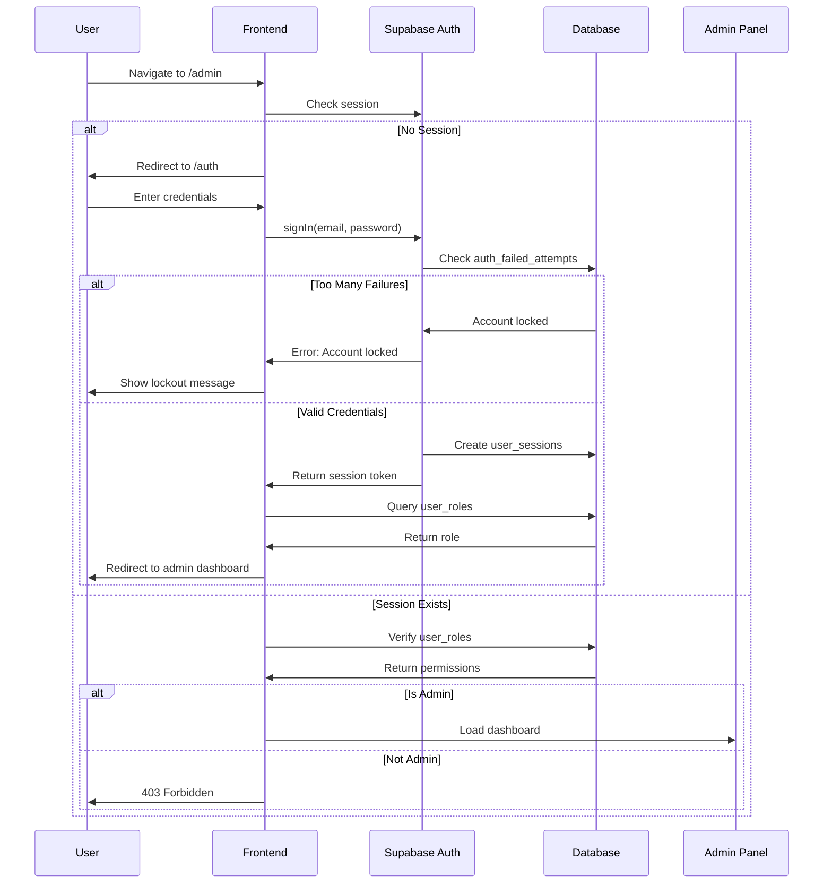
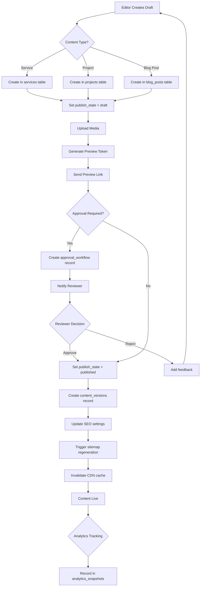
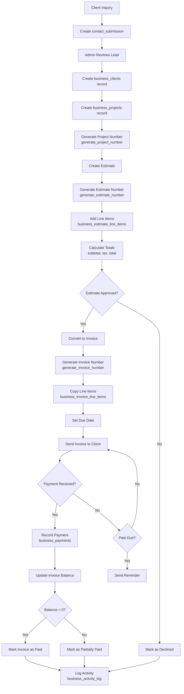
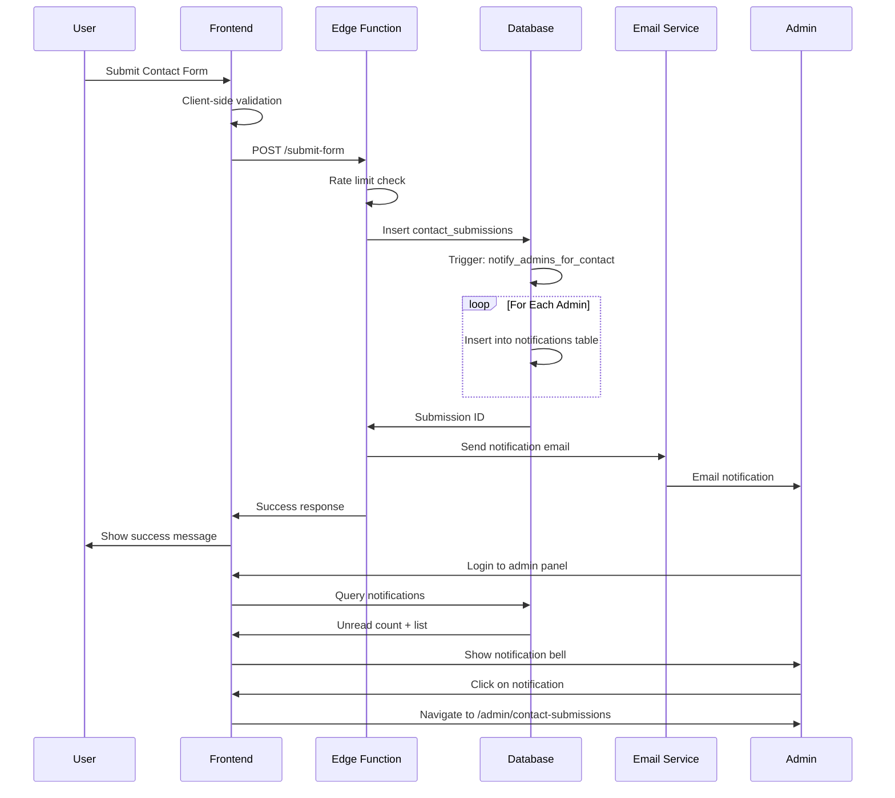
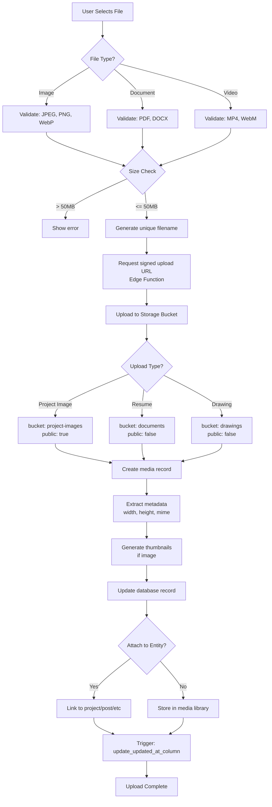
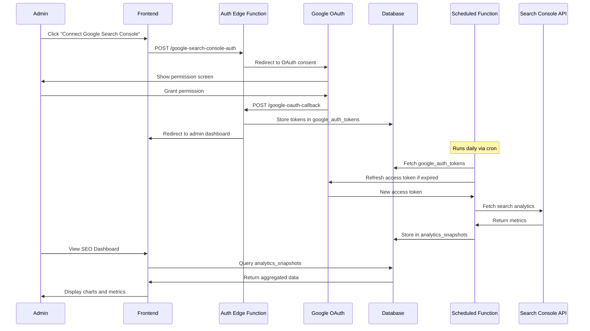
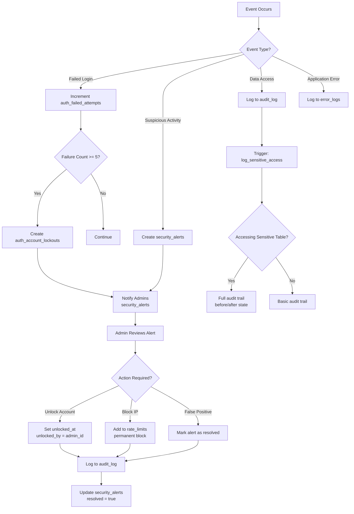
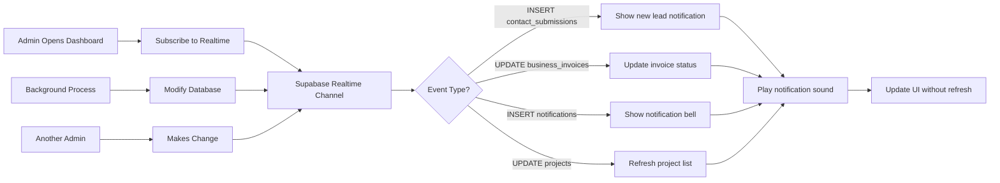
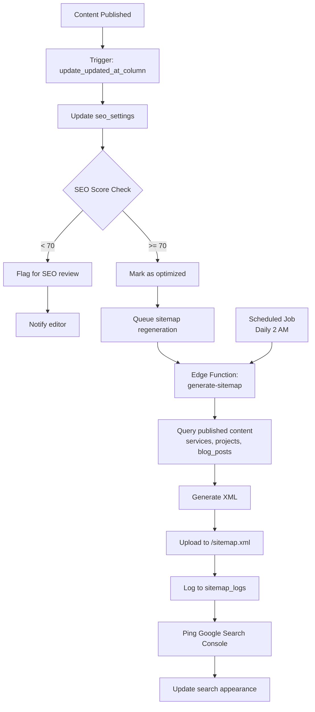
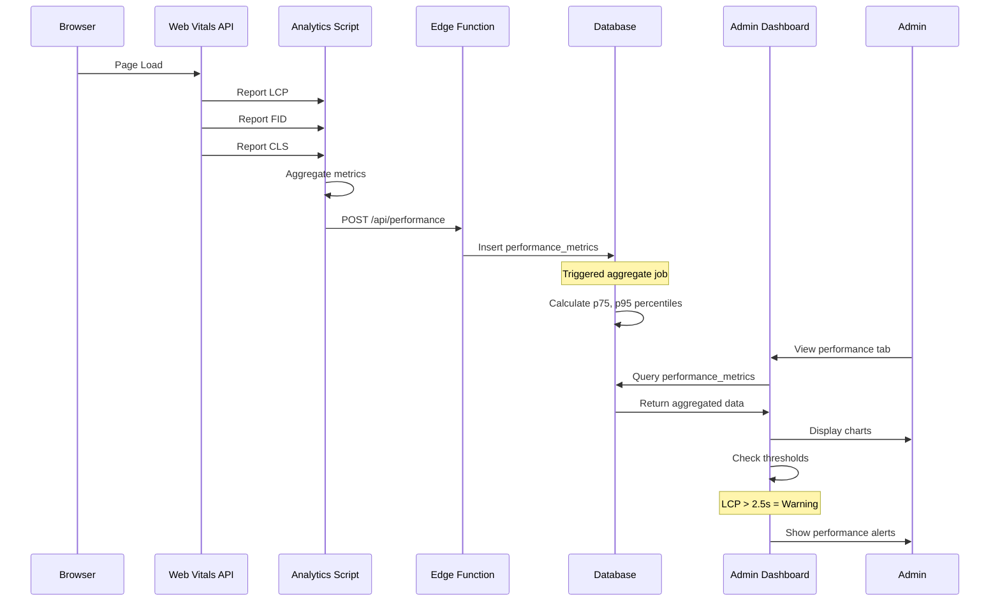

# Data Flow Diagrams

> Visual representations of key feature workflows in the AscentGroup platform

---

## 1. Authentication & Authorization Flow



**Key Security Points:**
- Failed login attempts tracked in `auth_failed_attempts`
- Account lockout after 5 failures (stored in `auth_account_lockouts`)
- Roles stored separately in `user_roles` table (not on profile)
- Session tokens stored in httpOnly cookies
- RLS policies check `is_admin(auth.uid())` for protected resources

---

## 2. Content Publishing Workflow



**Key Tables Involved:**
- Primary: `services`, `projects`, `blog_posts`
- Supporting: `media`, `content_versions`, `approval_workflows`, `seo_settings`
- Triggers: `auto_save_version()`, `notify_admins_*()`

**RLS Policies:**
- Draft content: Only visible to authenticated users
- Published content: Public access
- Preview tokens: Allow unauthenticated access if valid token

---

## 3. Business Management Flow (Estimate to Invoice to Payment)



**Auto-Generated Numbers:**
- Project: `PRJ-2025-001` (format: `PRJ-{year}-{sequence}`)
- Estimate: `EST-2025-001`
- Invoice: `INV-2025-001`

**Business Logic Functions:**
- `generate_project_number()` - Atomic sequence generation
- `generate_estimate_number()` - Atomic sequence generation
- `generate_invoice_number()` - Atomic sequence generation
- Triggers: `set_project_number()`, `set_estimate_number()`, `set_invoice_number()`

**Key Calculations:**
```sql
-- Line total
line_total_cents = quantity * unit_price_cents

-- Estimate/Invoice totals
subtotal_cents = SUM(line_total_cents)
tax_cents = subtotal_cents * tax_rate
total_cents = subtotal_cents + tax_cents

-- Invoice balance
balance_cents = total_cents - SUM(payments.amount_cents)
```

---

## 4. Lead Capture & Notification Flow



**Rate Limiting:**
- Function: `check_and_update_rate_limit(identifier, endpoint, limit, window)`
- Default: 50 requests per hour per IP
- Stored in `rate_limits` table

**Email Templates:**
- Contact submission → Admin notification
- Resume submission → HR notification
- Prequalification request → Sales notification

**Notification Types:**
```typescript
type NotificationType = 
  | 'contact_submission'
  | 'resume_submission'
  | 'prequal_submission'
  | 'project_updated'
  | 'security_alert';
```

---

## 5. File Upload & Media Management Flow



**Storage Buckets:**
- `project-images` - Public, used for portfolio galleries
- `documents` - Private, used for resumes and contracts
- `drawings` - Private, used for architectural drawings

**RLS Policies on Storage:**
```sql
-- project-images: public read
CREATE POLICY "Public can view project images"
ON storage.objects FOR SELECT
USING (bucket_id = 'project-images');

-- documents: admin only
CREATE POLICY "Only admins can view documents"
ON storage.objects FOR SELECT
USING (bucket_id = 'documents' AND is_admin(auth.uid()));
```

**Image Processing Pipeline:**
1. Original uploaded to storage
2. Background worker generates variants:
   - Thumbnail: 300x300
   - Small: 640x480
   - Medium: 1280x720
   - Large: 1920x1080
3. Store URLs in `media` table JSONB field

---

## 6. Search Console Integration Flow



**Edge Functions Involved:**
- `google-search-console-auth` - Initiate OAuth flow
- `google-oauth-callback` - Handle OAuth callback
- `scheduled-fetch-search-console` - Daily data sync
- `fetch-search-console-data` - Manual data fetch

**Token Management:**
- Access tokens expire after 1 hour
- Refresh tokens used to get new access tokens
- Tokens encrypted at rest in `google_auth_tokens` table

---

## 7. Security Monitoring & Incident Response Flow



**Monitored Events:**
- Failed login attempts
- Account lockouts
- Password resets
- Admin privilege escalation
- Bulk data exports
- Settings changes
- User role modifications

**Alerting Thresholds:**
- 5 failed logins → Account lockout
- 3 lockouts in 24h → Security alert to super_admin
- 100+ errors/hour → System alert
- Data export > 1000 records → Audit log

**Cleanup Jobs:**
- `cleanup_old_failed_attempts()` - Remove > 24h old
- `cleanup_expired_lockouts()` - Remove past lockouts
- `cleanup_expired_sessions()` - Remove expired sessions
- `cleanup_rate_limits()` - Remove > 1h old
- `cleanup_old_error_logs()` - Remove > 30 days old

---

## 8. Admin Dashboard Real-Time Updates Flow



**Realtime Configuration:**
```sql
-- Enable realtime for key tables
ALTER PUBLICATION supabase_realtime ADD TABLE public.contact_submissions;
ALTER PUBLICATION supabase_realtime ADD TABLE public.notifications;
ALTER PUBLICATION supabase_realtime ADD TABLE public.business_projects;
```

**Frontend Subscription:**
```typescript
const channel = supabase
  .channel('admin-updates')
  .on('postgres_changes', 
    { event: '*', schema: 'public', table: 'contact_submissions' },
    (payload) => {
      // Handle new lead
      showNotification('New lead received');
      refetchLeads();
    }
  )
  .subscribe();
```

---

## 9. SEO Automation & Sitemap Generation Flow



**Sitemap Structure:**
```xml
<urlset>
  <url>
    <loc>https://example.com/services/commercial-construction</loc>
    <lastmod>2025-01-04</lastmod>
    <changefreq>monthly</changefreq>
    <priority>0.8</priority>
  </url>
  <!-- More URLs -->
</urlset>
```

**SEO Scoring Factors:**
- Meta title present and optimal length (10 points)
- Meta description present (10 points)
- Focus keyword in title (20 points)
- Focus keyword in description (15 points)
- Alt tags on images (15 points)
- Internal links present (10 points)
- Content length > 300 words (20 points)

---

## 10. Performance Monitoring & Web Vitals Tracking Flow



**Tracked Metrics:**
- **Core Web Vitals:**
  - Largest Contentful Paint (LCP) - Target: < 2.5s
  - First Input Delay (FID) - Target: < 100ms
  - Cumulative Layout Shift (CLS) - Target: < 0.1

- **Custom Metrics:**
  - Time to First Byte (TTFB)
  - Time to Interactive (TTI)
  - Total Blocking Time (TBT)
  - Page load time by route

**Alert Conditions:**
```typescript
const alerts = {
  lcp: { warning: 2500, critical: 4000 },
  fid: { warning: 100, critical: 300 },
  cls: { warning: 0.1, critical: 0.25 },
  error_rate: { warning: 0.01, critical: 0.05 }
};
```

---

## Key Takeaways

1. **Security First:** All flows implement RLS, rate limiting, and audit logging
2. **Real-Time Updates:** Admin dashboard uses Supabase Realtime for live updates
3. **Automated Workflows:** Business logic handled by database functions and triggers
4. **Comprehensive Tracking:** Every action logged for compliance and debugging
5. **Performance Monitoring:** Continuous Web Vitals tracking with alerting
6. **Scalable Architecture:** Async processing for heavy operations (image processing, email sending)

---

## Related Documentation

- [Database ERD](./DATABASE_ERD.md)
- [Developer Onboarding Guide](./DEVELOPER_ONBOARDING.md)
- [API Specification](./API_SPECIFICATION.md)
- [Security Documentation](./SECURITY_PHASE1.md)
